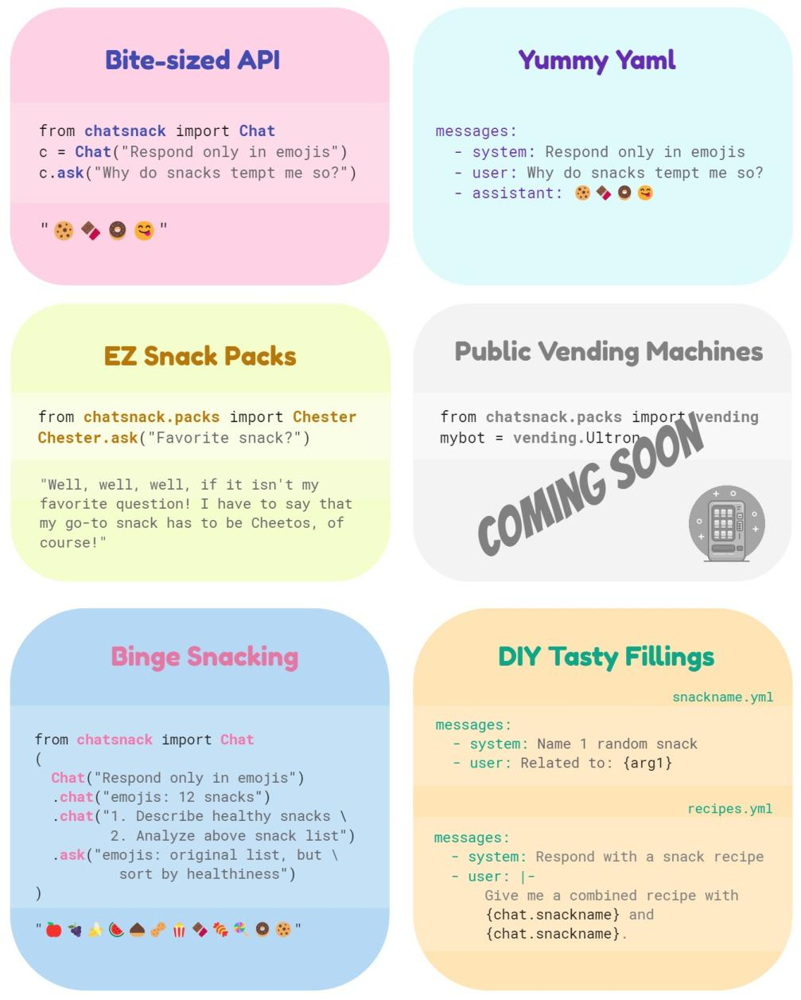

# chatsnack

chatsnack is a Python library for authored chat workflows with reusable prompt assets, YAML-backed chats, and Python-native tools.



{:.hero-copy}
These docs focus on the common path we want people to learn first: start from `Chat(...)`, use `ask()` and `chat()` intentionally, save durable YAML assets, compose prompts with fillings, and add tools through `utensils=[...]`.

<div class="callout-grid" markdown>
<div>
### Start Here

- [Getting Started](getting-started.md)
- [Chat Basics](guides/chat-basics.md)
</div>
<div>
### Build With Assets

- [YAML and Saved Assets](guides/yaml-and-assets.md)
- [Fillings and Composition](guides/fillings.md)
</div>
<div>
### Add Tools

- [Utensils](guides/utensils.md)
- [API Reference](reference/index.md)
</div>
</div>

## Why chatsnack

- `Chat` is the center of gravity for one-shot prompts and continuing threads.
- Chats serialize cleanly to YAML, so prompt work can live in version control.
- Reusable `Text` and saved chats make composition part of the product.
- `utensils=[...]` keeps local functions and hosted tools on one authored surface.

## Quick snack

```python
from chatsnack import Chat

chat = Chat("Respond only with the word POPSICLE from now on.")
print(chat.ask("What is your name?"))
```

## What is in this site

- **Getting Started** trims the README and notebook flow into one short first run.
- **Guides** explain the product story in the order people tend to need it.
- **Examples** collect a few compact patterns pulled from the notebooks and scripts.
- **API Reference** covers the stable public surface used in the guides.

## Raw source material

- [README on GitHub](https://github.com/Mattie/chatsnack/blob/master/README.md)
- [Getting Started notebook](https://github.com/Mattie/chatsnack/blob/master/notebooks/GettingStartedWithChatsnack.ipynb)
- [Experimenting notebook](https://github.com/Mattie/chatsnack/blob/master/notebooks/ExperimentingWithChatsnack.ipynb)
